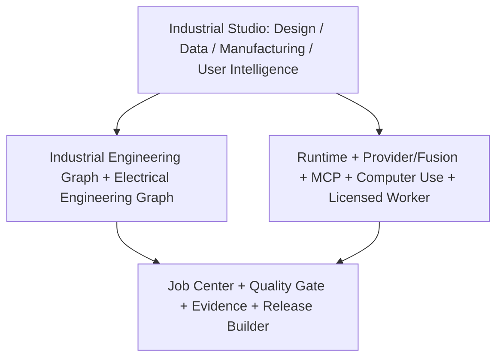

# Industrial Intelligence Architecture

## Purpose

Industrial Studio turns one verified engineering graph into design, data, manufacturing, workflow, evidence, and release views. It does not treat prompts, generated documents, screenshots, or vendor file names as authoritative engineering state.

The first flagship vertical is ECAD electrical control cabinets. Other domains remain supported by the existing project, adapter, and Domain Pack boundaries, but they are not expanded ahead of the ECAD evidence loop.

## Product Information Architecture

### Design Intelligence

Owns requirements, functional locations, systems, circuits, devices, interfaces, parameters, connections, schematic semantics, numbering, cross-references, validation, and design change impact.

Outputs are deterministic views of semantic objects. An SVG or DXF drawing must retain links to stable graph entities; an image without electrical objects is not an engineering drawing.

### Data Intelligence

Owns catalog import, field normalization, manufacturer parts, enterprise material codes, symbols, 3D model associations, suppliers, prices, lifecycle status, alternatives, duplicate detection, data quality scoring, and enrichment evidence.

Every enrichment records source, effective date, checksum, validation status, and evidence. Model inference may propose a mapping but cannot silently raise the data quality score.

### Manufacturing Intelligence

Owns cabinet, enclosure, mounting plate, DIN rail, wire duct, busbar, placement, collision, spacing, routing, wire length, duct fill, terminals, labels, cut lists, drilling/milling neutral output, assembly instructions, FAT/SAT, and machine postprocessors.

Neutral manufacturing output is distinct from machine-specific output. Machine output requires a versioned postprocessor, schema validation, human approval, checksum, and linked source graph revision. An LLM cannot emit executable machine control code directly into a passed artifact.

### User Intelligence

Owns role-based onboarding, simple/expert modes, contextual help, approvals, decisions, preferences, exception handling, and workflow evidence. It adapts presentation and guidance, not engineering truth.

## Shared Platform Layers



### Runtime

Provides authoritative thread, turn, tool, approval, artifact, and event semantics. Industrial operations use the same durable Runtime and cannot create a second hidden job state.

### Provider and Fusion

Model Providers supply bounded reasoning or generation. External Agent Providers perform autonomous isolated work. Fusion may propose and judge candidates, but only deterministic tools, tests, quality gates, or explicit human approvals can create verified evidence.

### MCP

Provides managed stdio and Streamable HTTP tool access with negotiated capabilities, bounded sessions, cancellation, timeout, secret references, OAuth lifecycle, and redacted logs.

### Computer Use

Acts only as the final fallback after API/SDK, Licensed Worker, and File Exchange. It is application-allowlisted, approval-scoped, auditable, mask-aware, pausable, resumable, and emergency-stoppable.

### Licensed Worker

Runs commercial or isolated engineering tools in a licensed environment. Results include connector, tool version, project reference, artifact checksum, status, diagnostics, and evidence. Authentication and license availability remain external prerequisites.

### Job Center, Quality Gate, Evidence, and Release Builder

Every design, import, validation, connector, manufacturing, and release action enters Job Center. Quality Gates bind results to artifacts and graph revisions. Evidence records provenance and truthful status. Release Builder blocks failed or unapproved work and makes simulated/not-run content conspicuous.

## Canonical Industrial Graph

The graph core contains:

- `Requirement`
- `System`
- `Subsystem`
- `Component`
- `Interface`
- `Parameter`
- `Unit`
- `Material`
- `Artifact`
- `Verification`
- `Evidence`
- `Cost`
- `ManufacturingOperation`
- `ChangeImpact`

Relationships are versioned. Every node and relationship has stable identity, source, status, revision, and checksum. Invalid units, dangling references, stale revisions, or missing evidence fail validation rather than being repaired silently.

## Canonical Electrical Graph

The ECAD extension contains:

- `ElectricalProject`, `FunctionLocation`, `Circuit`, `Panel`
- `Device`, `ManufacturerPart`, `Terminal`, `PLCPoint`
- `Connection`, `Wire`, `Cable`
- `Enclosure`, `MountingPlate`, `DINRail`, `WireDuct`, `Busbar`
- `QuoteLine`, `BOMLine`, `ManufacturingOperation`
- `ValidationRule`, `Drawing`, `Revision`

Every entity supports stable id, version, source, unit where applicable, traceability, status, checksum, and validation evidence. Drawing geometry and labels reference entity ids so numbering, BOM, ERC, routing, and change impact operate on the same facts.

## Connector Architecture

```text
Canonical Electrical Graph
  -> Neutral Exchange
  -> Official API or Licensed Worker
  -> File Exchange
  -> Computer Use fallback
```

The first connector profiles are EPLAN, SOLIDWORKS Electrical, SEE Electrical, and 利驰. WSCAD is a capability benchmark until an official or licensed integration route exists.

Connector state is always one of:

- `real`: a licensed/versioned execution produced verified evidence.
- `simulated`: Hi Code produced a safe simulation or planning artifact.
- `not_run`: an executable route exists but was not run.
- `external_required`: a licensed environment or operator is required.
- `unsupported`: no supported route exists.
- `approval_required`: the next action is valid but blocked on explicit approval.

These values are not presentation labels; they are persisted protocol and release semantics. No UI, adapter, gate, or release layer may translate them into `passed` without corresponding evidence.

## ECAD Control Cabinet Vertical

The complete vertical follows one graph revision through:

1. Natural-language requirement capture and validation.
2. Component recommendation with catalog provenance.
3. Quotation and cost evidence.
4. Semantic schematic, deterministic layout, numbering, and cross-references.
5. BOM and PLC I/O.
6. Cabinet, plate, rail, duct, terminal, and busbar model.
7. Placement, collision, spacing, routing, length, and fill validation.
8. Cut list, drilling/milling neutral output, and CNC neutral package.
9. Connector or postprocessor execution under approval.
10. ERC, manufacturing checks, FAT/SAT, Release Package, and Evidence Binder.

The release is blocked when a critical artifact is absent, a gate failed, a required approval is unresolved, a checksum does not match, or a simulated/not-run operation is required for the claimed delivery target.

## Security and Truth Boundaries

- Credentials use secret references and OS secure storage; no graph, artifact, support bundle, or log contains values.
- Paths are workspace or app-data confined.
- External processes receive a minimal environment and run under the execution policy.
- Connector network access, application control, and machine output require explicit scopes.
- Sensitive screenshots are masked before provider transport.
- Human approval is a recorded decision linked to actor, scope, time, graph revision, and action fingerprint.
- Commercial software installation, authentication, license, and environment health are never inferred from adapter presence.

## Release Evidence

An industrial release binds:

- canonical graph revision and checksums,
- requirements and accepted changes,
- design/data/manufacturing artifacts,
- Provider and connector provenance,
- quality gate evidence,
- approvals and exceptions,
- known risks and simulated/not-run boundaries,
- postprocessor and tool versions,
- package checksums.

The Evidence Binder is generated from these records. It is not a narrative substitute for missing execution evidence.
