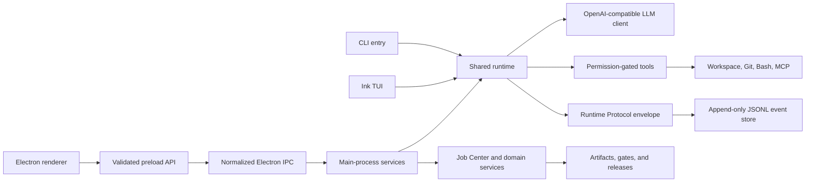
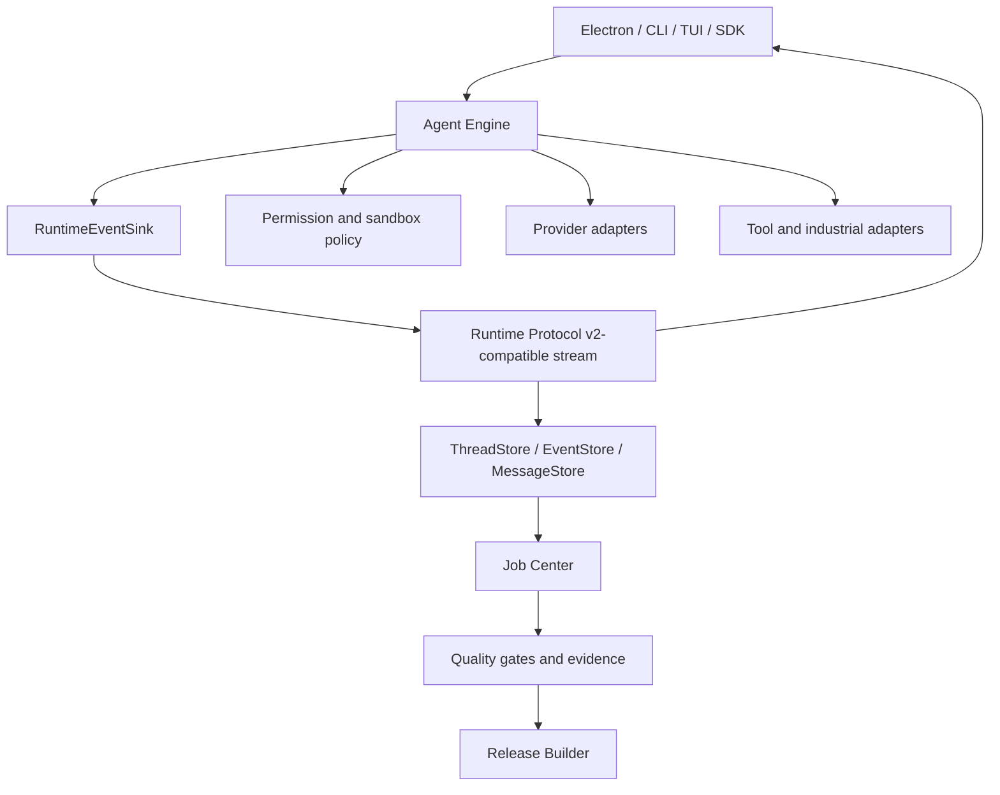

# Hi Code Program Architecture

Status: Current-state map plus accepted migration target

Baseline: `0.6.0-alpha.6` at `6ed9ed666bb817f8d1e863c76b0bf61b31c7b52d`

## Architectural Objective

One engine must support Electron, CLI, TUI, future SDK/app-server clients, isolated provider execution, and industrial engineering workflows. Runtime events, permissions, artifacts, gates, and release evidence are shared contracts. UI surfaces and tool adapters are clients of those contracts, not alternate implementations of them.

## Current Runtime Topology

The diagram describes implemented connections. It does not imply that every client consumes the protocol as its sole data source yet.

## Production Entrypoints

- Package and CLI metadata: `package.json`
- CLI: `src/index.ts` compiled to `dist/index.js`
- TUI: `src/tui.tsx`
- Electron main: `electron/main.mjs`
- Electron preload: `electron/preload.cjs`
- Renderer document: `renderer/index.html`
- Renderer bootstrap: `renderer/renderer.js` and `renderer/app/bootstrap.js`

Root-level legacy `main.mjs`, `renderer.js`, and `index.html` are not production entrypoints. Archived v0.4 files live under `legacy/v0.4/` and must not be reintroduced into package metadata.

## Current Boundaries

### Core runtime

`src/runtime.ts` orchestrates model turns, permissions, tool calls, events, and session state. `src/agent.ts`, `src/llm.ts`, and `src/tools/` provide model and tool behavior. `src/process-env.ts` builds minimal child-process environments.

### Protocol and persistence

`src/runtime-protocol.ts` defines versioned event envelopes. `src/runtime-event-store.ts` appends valid events to JSONL. `src/session-store.ts` retains full legacy conversation state, while `src/recovery.ts` merges protocol and legacy recovery information during migration.

Current limitation: protocol events do not yet carry first-class assistant delta/completed content for every client. Desktop still depends on compatibility output bridging for part of the transcript. Full model-context resume still depends on session JSON. HC-RUN-201 and later runtime-store tasks close these gaps incrementally.

### Electron shell

`electron/main.mjs` owns window lifecycle and service composition. `electron/ipc/register-ipc-handlers.mjs` is the single handler registration point. Service modules under `electron/services/` validate and delegate runtime, workspace, Git, Store, Job, Provider, Arena, industrial, gate, sample, and release operations.

`electron/preload.cjs` exposes a bounded API. The renderer never receives raw `ipcRenderer` or Node access.

### Renderer

`renderer/app/state.js` owns explicit renderer state. `renderer/api/hicode-api.js` normalizes preload calls and failures. Components under `renderer/components/` own panel rendering and user actions. `renderer/renderer.js` remains a compatibility composition layer while behavior migrates into components.

### Engineering services

The Job Center is the durable execution record. Providers, isolated worktrees, Patch Arena, industrial projects, Domain Packs, agent teams, tool adapters, quality gates, sample generation, and release packaging write events and artifacts through their existing stores and Electron services.

## Persistence Map

| Data | Current location | Authority today | Migration direction |
| --- | --- | --- | --- |
| User config and credentials | Hi Code app data / config files with restricted permissions | Config service | Move secret material to platform secure storage |
| Full chat sessions | Local session JSON | Required for full context resume | Rebuild from typed event/message stores |
| Runtime events | `~/.hicode/runtime-events/<session>.jsonl` | Append-only recovery and replay evidence | Become authoritative transcript/execution stream |
| Job Center | App-data Job Store | Job execution and artifact audit | Retain with protocol references |
| Industrial project | Workspace `.hicode/project.json` | Project artifact and traceability model | Retain with schema migrations |
| Generated artifacts | Workspace `.hicode/artifacts`, generated docs, releases | File plus metadata/evidence | Retain; strengthen checksums and provenance |

No migration may silently discard a legacy store. Importers are idempotent, preserve original files until verification, and record the source format and migration result.

## Accepted Target

The target is implemented through compatibility layers:

1. HC-RUN-201 injects `RuntimeEventSink` and emits assistant output without removing legacy events.
2. Runtime store tasks introduce typed store interfaces and import existing JSON/JSONL data.
3. Desktop, CLI, and TUI migrate to protocol-derived projections one surface at a time.
4. Provider and tool execution continue to use Job Center, worktree isolation, permission, and path boundaries.
5. Legacy output/session paths are removed only after replay, recovery, and client parity tests pass.

## Runtime Contract Rules

- Event IDs, session IDs, turn IDs, and sequence numbers are stable and validated.
- Per-session sequence is monotonic; concurrent sessions cannot share mutable output buffers.
- Assistant text is data in `assistant.delta` and `assistant.completed` style events, never inferred from global stdout.
- Tool output, approval requests, diffs, errors, and completion retain typed status and visibility.
- Append failure is observable and cannot be reported as durable success.
- Compatibility fields may remain during migration but cannot become a second authority.

## Security Architecture

- Electron uses `contextIsolation: true`, `nodeIntegration: false`, renderer sandboxing, local `loadFile`, CSP, navigation denial, and bounded preload APIs.
- All IPC requests pass argument validation and normalized error handling.
- Workspace operations resolve real paths and reject symlink/path escape.
- Mutating tools and external adapters require explicit permission unless the user selected a documented higher-trust mode.
- Child processes receive minimal allowlisted environments; tokens, secrets, passwords, keys, and unknown sensitive variables are excluded by default.
- Store and Domain Pack remote installs require HTTPS, safe destinations, and manifest validation. Remote manifests cannot inject local source paths or automatic scripts.
- Commercial adapters never bypass licensing, VPN, identity, or enterprise authorization. Plaintext credentials are not persisted.
- Logs and evidence redact secret-like data before persistence.

## Quality And Release Architecture

`scripts/verify.mjs` is package-manager independent and runs the repository's build, syntax, feature, service, runtime, renderer, entrypoint, security, industrial, DoD, and usage suites. `scripts/scan-dod.mjs` scans the full delivery tree for blocking skeleton risks. `scripts/audit-production.mjs` audits only package-lock production packages through the HTTPS npm advisory endpoint.

`npm run program:baseline` archives exact command logs and hashes under `reports/evidence/baseline/`. Release promotion requires a fresh candidate capture, real Electron E2E, platform package smoke tests, and honest unresolved-risk handling.

## Industrial Extension Contract

Industrial modules may add schemas, templates, adapter capability declarations, diagnostics, artifacts, and gates. They may not create a parallel runtime or permission system. Every result carries provenance and one of the truthful execution states. SolidWorks and AVEVA remain bridge/external-required integrations until a licensed local connector is configured, authorized, and verified.

No new industrial domain implementation begins before HC-RUN-201 is accepted.

## Architectural Non-Goals

- No big-bang rewrite of Electron, renderer, runtime, or persistence.
- No copied Codex or Claude Code implementation.
- No feature-count or repository-size parity claim without verified behavior.
- No automatic merge from Patch Arena.
- No real industrial execution claim based only on a generated plan.
- No weakening of tests, security, DoD, or skeleton detection to make a release pass.
