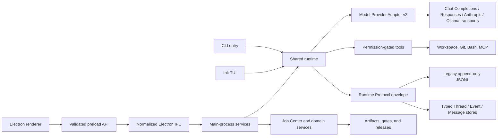
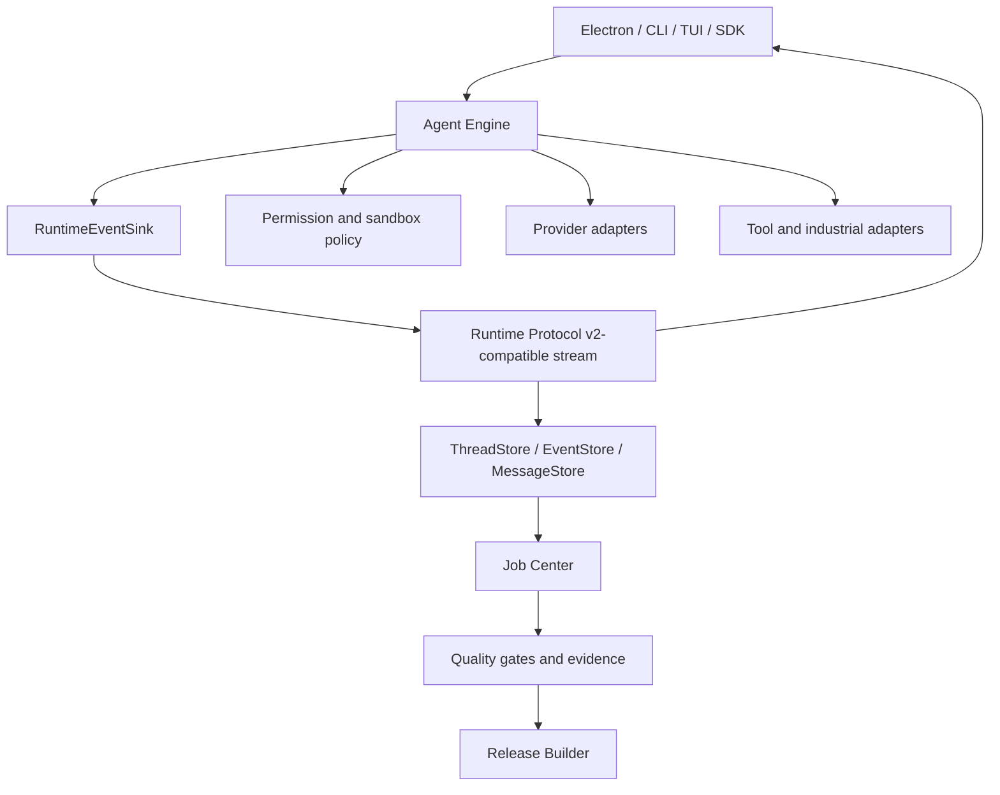

# Hi Code Program Architecture

Status: Current-state map plus accepted migration target

Baseline: verified `0.6.0-alpha.8` development line

## Architectural Objective

One engine must support Electron, CLI, TUI, future SDK/app-server clients, isolated provider execution, and industrial engineering workflows. Runtime events, permissions, artifacts, gates, and release evidence are shared contracts. UI surfaces and tool adapters are clients of those contracts, not alternate implementations of them.

## Current Runtime Topology

The diagram describes implemented connections. It does not imply that every client consumes the protocol as its sole data source yet.

## Production Entrypoints

- Package and CLI metadata: `package.json`
- CLI: `src/index.ts` compiled to `dist/index.js`
- TUI: `src/tui.tsx`
- Electron main: `electron/main.mjs`
- Electron preload: `electron/preload.cjs`
- Renderer document: `renderer/index.html`
- Renderer bootstrap: `renderer/renderer.js`, generated `renderer/generated/app-shell.js`, and legacy `renderer/app/bootstrap.js`

Root-level legacy `main.mjs`, `renderer.js`, and `index.html` are not production entrypoints. Archived v0.4 files live under `legacy/v0.4/` and must not be reintroduced into package metadata.

## Current Boundaries

### Core runtime

`src/runtime.ts` orchestrates model turns, permissions, tool calls, events, and session state. `src/agent.ts` calls the capability-negotiated `src/model-provider.ts` facade; `src/llm.ts` is the low-level compatibility transport and is not an orchestration boundary. `src/tools/` provides tool behavior. `src/process-env.ts` builds minimal child-process environments.

`src/attachment-store.ts` owns typed, content-addressed app-data attachments. Session messages retain `attachment_ref` values while `src/attachment-materializer.ts` verifies and converts supported content at the provider boundary. `src/command-registry.ts` is the shared shell/slash/native/agent classifier; Electron may execute a resolved native route but does not maintain a second input classifier.

The Model Provider Adapter is separate from `src/agent-provider.ts`. Model providers execute one model request and normalize text, tool-call, usage, interruption, and error semantics. Agent providers execute a whole delegated engineering task, potentially in an isolated workspace.

Model profiles select their wire transport explicitly. Existing profiles omit `protocol` and stay on the `src/llm.ts` Chat Completions compatibility path. Profiles can select `responses`, `anthropic_messages`, or `ollama_chat` for the dedicated modules under `src/`; all paths converge on the same Model Provider v2 events and Runtime Protocol. Transport selection never depends on hostname inference and does not rewrite persisted sessions or runtime stores. Native provider HTTP decoding is bounded, remote endpoints require HTTPS, and raw Anthropic/Ollama thinking remains outside assistant text and persistence.

MCP remains behind the compatibility manager in `src/mcp.ts`. Existing and omitted transports resolve to managed stdio; remote servers opt into the transport-neutral Streamable HTTP implementation in `src/mcp-transport.ts`. JSON-RPC negotiation and normalized failures live in `src/mcp-protocol.ts`, while bearer/OAuth expiry, discovery, PKCE, refresh, and token rotation live in `src/mcp-auth.ts`. Desktop credentials are resolved through scoped secret references, never projected into Renderer state, and rotated credentials plus expiry metadata are committed atomically by the main-process secret store. Lifecycle operations retain the same manager API for CLI and TUI clients.

### Protocol and persistence

`src/runtime-protocol.ts` defines versioned event envelopes. `src/runtime-event-store.ts` preserves legacy JSONL while synchronizing validated events into the typed store. `src/runtime-stores.ts` owns typed thread, event, and normalized model-message contracts. `src/session-store.ts` remains the compatibility facade. `src/turn-state-machine.ts` derives conservative crash, approval, and tool recovery from durable events; `src/recovery.ts` projects those plans through the compatibility IPC and treats evidence-poor legacy failures as inspection-only.

HC-RUN-201 moved assistant text to first-class protocol events. HC-RUN-202 adds exact hidden `message.appended` records and reconstructs full system/user/assistant/tool context without session JSON. Streams created before normalized messages remain read-only rather than receiving guessed context.

### Electron shell

`electron/main.mjs` owns window lifecycle and service composition. `electron/ipc/register-ipc-handlers.mjs` is the single handler registration point. Service modules under `electron/services/` validate and delegate runtime, workspace, Git, Store, Job, Provider, Arena, industrial, gate, sample, release, editor, and integrated-terminal operations. Native PTY ownership remains in the main process and is never projected as a renderer primitive.

`electron/preload.cjs` exposes a bounded API. The renderer never receives raw `ipcRenderer` or Node access.

`electron/services/secret-store-service.mjs` owns desktop credential
persistence. Config and Agent Provider state contain only scoped references;
encrypted values remain in an owner-private `safeStorage` vault. Migration runs
after Electron is ready and before services or Runtime start. The renderer sees
sanitized config and configured/not-configured status only.

### Renderer

`renderer/app-shell/` owns the typed React shell route and compact-navigation state. Vite creates a local production bundle during build; generated code is not committed. `renderer/app-shell/legacy-panel-adapter.ts` validates the current panel DOM and is the production shell-level visibility writer. It sends new navigation intent through existing real triggers, so no business panel is duplicated. CodeMirror and xterm are separate lazy chunks; their Renderer modules own presentation only, while workspace files and PTY processes remain main-process services.

`renderer/app/state.js` continues to own legacy business state. `renderer/api/hicode-api.js` normalizes preload calls and failures. Components under `renderer/components/` own panel rendering and user actions. `renderer/renderer.js` mounts the typed shell and then calls the legacy bootstrap as a compatibility composition layer. Panels migrate one route at a time; the React shell is not a second Runtime, API, or persistence authority.

### Engineering services

The Job Center is the durable execution record. Providers, isolated worktrees, Patch Arena, industrial projects, Domain Packs, agent teams, tool adapters, quality gates, sample generation, and release packaging write events and artifacts through their existing stores and Electron services.

### Coding delivery loop

The Electron main process owns prompt order through `RuntimeJobQueue`. Plan mode is durable queue metadata plus a read-only tool boundary. Steer records a Job event, cancels the active queue item, aborts the active Runtime, and inserts a new follow-up; it is not represented as in-stream provider mutation. Ordinary Runtime failures are rethrown to the queue so they remain persisted failures.

Local delivery uses `src/git.ts`, `src/git-collaboration.ts`, and `electron/services/git-service.mjs`. Branch and Pull Request mutations require a clean selected repository, GitHub calls use the external `gh` credential store with a minimal child environment, and PR creation requires fresh native confirmation. No coding-loop operation performs stash, reset, clean, force push, merge, rebase, auto-merge, or release publication. CI projection preserves failed, pending, skipped, and unknown states.

## Persistence Map

| Data | Current location | Authority today | Migration direction |
| --- | --- | --- | --- |
| User config | Hi Code app-data `config.json` and `providers/providers.json` | Config/workspace and Provider services | Persist non-secret settings plus versioned `secretRef` values |
| Desktop credentials | Hi Code app-data `secrets/vault.json` encrypted with Electron `safeStorage` | Secret Store service in Electron main | Retain encrypted snapshots and value-free migration journal for controlled rollback |
| Full chat sessions | Local session JSON plus typed message snapshots | Compatibility write plus complete resume source | Remove legacy authority only after a later verified migration |
| Runtime events | Legacy `~/.hicode/runtime-events/<session>.jsonl` plus typed event records | Append-only execution authority with non-destructive import | Retain legacy source for rollback during v0.6 |
| Typed runtime context | `~/.hicode/runtime-store-v2/<session>/` | Thread metadata, exact model messages, normalized events | Backend remains replaceable behind interfaces |
| Attachment metadata and blobs | Hi Code app data `attachments-v2/` | Typed records, session ownership, SHA-256 verified bytes | Add provider-native PDF/file transports without changing persistence |
| Job Center | App-data Job Store | Job execution and artifact audit | Retain with protocol references |
| Industrial project | Workspace `.hicode/project.json` | Project artifact and traceability model | Retain with schema migrations |
| Generated artifacts | Workspace `.hicode/artifacts`, generated docs, releases | File plus metadata/evidence | Retain; strengthen checksums and provenance |

No migration may silently discard a legacy store. Importers are idempotent, preserve original files until verification, and record the source format and migration result.

## Accepted Target

The target is implemented through compatibility layers:

1. HC-RUN-201 injects `RuntimeEventSink`, emits assistant output, and migrates Electron/CLI/TUI projections without removing legacy event fields.
2. Runtime store tasks introduce typed store interfaces and import existing JSON/JSONL data.
3. Desktop, CLI, and TUI migrate to protocol-derived projections one surface at a time.
4. Provider and tool execution continue to use Job Center, worktree isolation, permission, and path boundaries.
5. Legacy output/session paths are removed only after replay, recovery, and client parity tests pass.

## Runtime Contract Rules

- Event IDs, session IDs, turn IDs, and sequence numbers are stable and validated.
- Per-session sequence is monotonic; concurrent sessions cannot share mutable output buffers.
- Assistant text is data in `assistant.delta` and `assistant.completed` style events, never inferred from global stdout.
- Tool output, approval requests, diffs, errors, and completion retain typed status and visibility.
- Model capability requirements are negotiated before transport execution; provider request, tool-call, usage, and normalized failure events retain run/call correlation.
- Durable attachment references are verified and materialized only after capability negotiation; unsupported content fails before network I/O.
- Shell, slash, native, and agent input resolve through one registry; unknown or ambiguous command routes fail closed.
- Append failure is observable and cannot be reported as durable success.
- Compatibility fields may remain during migration but cannot become a second authority.

## Runtime Client Projection

`RuntimeEventBus` is the in-process fan-out contract. Runtime persistence happens before delivery, so a failed UI subscriber cannot turn a durable event into a failed Agent turn. Subscribers may filter by session, turn, and event type; listener failures are isolated and reported without stopping other clients.

`connectAssistantOutput(...)` is the typed client boundary. `connectAssistantTextOutput(...)` is the compatibility projection used by the three current clients. It renders deltas once, falls back to completed content for non-streaming providers, and never repeats full content after deltas.

Electron keeps its existing `output` and `tool-event` IPC channels while changing their source to protocol projections. CLI and TUI instantiate private buses. The global desktop/TUI console bridges remain temporary command/tool compatibility paths only; they are not assistant message authorities.

## Security Architecture

- Electron uses `contextIsolation: true`, `nodeIntegration: false`, renderer sandboxing, local `loadFile`, CSP, navigation denial, and bounded preload APIs.
- All IPC requests pass argument validation and normalized error handling.
- Workspace operations resolve real paths and reject symlink/path escape.
- Mutating tools and external adapters require explicit permission unless the user selected a documented higher-trust mode.
- Child processes receive minimal allowlisted environments; tokens, secrets, passwords, keys, and unknown sensitive variables are excluded by default.
- Remote MCP requires HTTPS except loopback development, rejects URL credentials and authentication-bearing custom headers, bounds JSON/SSE input, and redacts transport and OAuth audit data before persistence.
- Integrated terminal startup is one explicit permission decision for an interactive shell session. The shell starts in the active workspace and closes on owner/workspace/app lifecycle changes, but retains the desktop user's OS permissions and does not claim filesystem sandboxing.
- Managed child execution uses one versioned policy kernel. macOS and Linux isolation backends are probed and reported as partial, Windows remains weak without a reviewed restricted token, and every non-interactive runner records timeout/output/process-tree evidence without arguments or environment values.
- Store and Domain Pack remote installs require HTTPS, safe destinations, and manifest validation. Remote manifests cannot inject local source paths or automatic scripts.
- Commercial adapters never bypass licensing, VPN, identity, or enterprise authorization. Plaintext credentials are not persisted.
- Logs and evidence redact secret-like data before persistence.
- Desktop model, MCP, and Provider credentials are encrypted through Electron
  `safeStorage`; Linux `basic_text` and unavailable backends fail closed. CLI
  credentials use explicit environment variables and are never copied into
  config by model-selection writes.

## Quality And Release Architecture

`scripts/verify.mjs` is package-manager independent and runs the repository's build, syntax, feature, service, runtime, renderer, entrypoint, security, industrial, DoD, and usage suites. `scripts/scan-dod.mjs` scans the full delivery tree for blocking skeleton risks. `scripts/audit-production.mjs` audits only package-lock production packages through the HTTPS npm advisory endpoint.

`npm run program:baseline` archives exact command logs and hashes under `reports/evidence/baseline/`. Release promotion requires a fresh candidate capture, real Electron E2E, platform package smoke tests, and honest unresolved-risk handling.

## Industrial Extension Contract

Industrial modules may add schemas, templates, adapter capability declarations, diagnostics, artifacts, and gates. They may not create a parallel runtime or permission system. Every result carries provenance and one of the truthful execution states. SolidWorks and AVEVA remain bridge/external-required integrations until a licensed local connector is configured, authorized, and verified.

No new industrial domain implementation begins before HC-RUN-201 is accepted.

## Architectural Non-Goals

- No big-bang rewrite of Electron, renderer, runtime, or persistence.
- No copied Codex or Claude Code implementation.
- No feature-count or repository-size parity claim without verified behavior.
- No automatic merge from Patch Arena.
- No real industrial execution claim based only on a generated plan.
- No weakening of tests, security, DoD, or skeleton detection to make a release pass.
