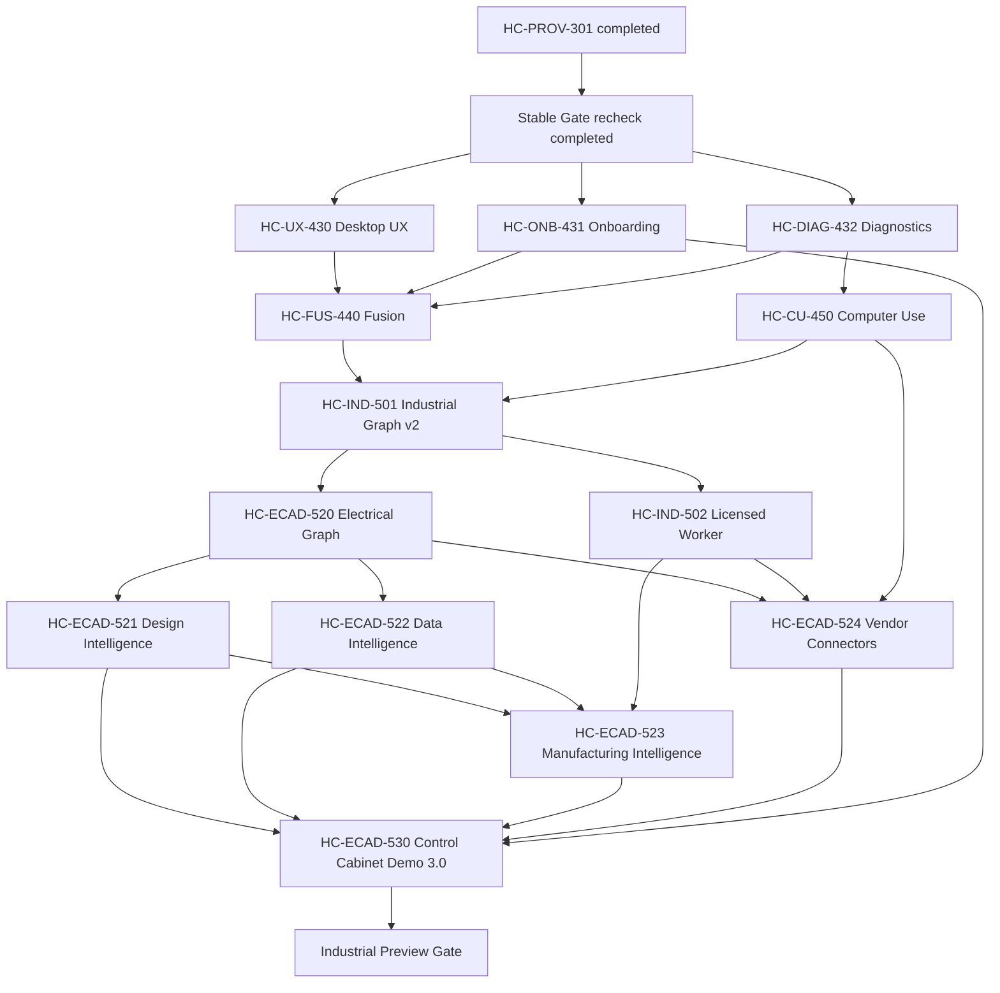

# VOC-2026-07-14 Program Change

Recorded: 2026-07-15

Source: verified customer feedback from active Hi Code users

Status: accepted into the controlled program backlog

## Decision

Hi Code will stop spreading engineering effort evenly across every industrial domain. The next program increment concentrates on six outcomes, in dependency order:

1. Preserve the completed Provider Production Hardening and rechecked Stable engineering baseline.
2. Stabilize the real desktop experience, permissions, performance, onboarding, and diagnostics.
3. Add evidence-backed Multi-Provider Fusion rather than concatenating model answers.
4. Add secure, allowlisted, approval-scoped Computer Use as the last execution fallback.
5. Establish one canonical Industrial Engineering Graph.
6. Deliver ECAD electrical control cabinets as the first complete industrial flagship vertical.

The existing Runtime, Provider, MCP, Job Center, Quality Gate, Evidence, Release Builder, security, and packaging work remains authoritative. This change does not reopen or recreate `HC-MCP-410`, `HC-SEC-402`, `HC-REL-420`, `HC-PROV-301`, or the completed Stable Gate assessment.

## Verified Starting Point

- `HC-PROV-301`: completed with committed implementation and evidence.
- `RISK-PROV-001`: closed.
- `HC-MCP-410`: passed.
- `HC-SEC-402`: passed.
- `HC-REL-420`: passed.
- Stable engineering baseline: passed with internal status `PASS_INTERNAL_ONLY`.
- `RISK-REL-001`: remains open and blocks signed stable promotion only.
- Baseline at program-change intake: build, verify, release check, feature tests, Program Control, and full-tree DoD scan passed; DoD findings were zero.

No signing, notarization, Windows publisher reputation, or stable update-chain result is inferred from the engineering baseline.

## Customer Problems Being Solved

### Desktop confidence

Users report fragmented execution settings, repeated permissions, inconsistent native editing behavior, slow Store views, and layouts that lose important controls at smaller widths. `HC-UX-430` treats these as one product reliability problem, with measurable latency and responsive E2E acceptance.

### Learnability

The current product exposes expert capabilities before users know which workflow to choose. `HC-ONB-431` introduces role-based startup, simple/expert modes, a live five-minute tutorial, sample launch, contextual help, and a six-step industrial project wizard. Static documentation alone cannot satisfy this task.

### Truthful capability state

Users need to know whether Runtime, Provider, MCP, Sandbox, Keychain, Worker, Adapter, and Build capabilities are effective, weak, unavailable, or awaiting approval. `HC-DIAG-432` provides the same probes to Desktop and `hicode doctor`, plus a redacted support bundle.

### Better answers without hidden cost or false verification

`HC-FUS-440` adds Planner, independent Provider candidates, Critic, Judge, Synthesizer, and a Tool/Test/Gate verifier under explicit token, cost, latency, and privacy budgets. Disagreement and provenance stay visible. A synthesis without evidence cannot be marked verified.

### Controlled interaction with desktop applications

`HC-CU-450` supplies a `ComputerActionProvider` only after API/SDK, Licensed Worker, and File Exchange routes are unavailable. Application allowlists, scoped approvals, sensitive-region masking, audit, pause/resume, and emergency stop are mandatory. Commercial software is not claimed supported until real licensed evidence exists.

### One industrial flagship with engineering semantics

The ECAD sequence builds a canonical electrical graph, catalog intelligence, semantic schematic output, manufacturing intelligence, vendor connector boundaries, and a full control-cabinet delivery. Images without electrical objects, unvalidated BOMs, direct LLM machine code, and simulated results labeled real are explicitly prohibited.

## Dependency Order

`HC-UX-430`, `HC-ONB-431`, and `HC-DIAG-432` may run in parallel after integration of this program change. `HC-FUS-440` and `HC-CU-450` may run in parallel after their declared dependencies. `HC-IND-502` and `HC-ECAD-520` may run in parallel after `HC-IND-501`.

## Worktree Plan

| Task | Branch | Worktree | Start condition |
| --- | --- | --- | --- |
| Program change | `codex/program-control/voc-2026-07-14` | `worktrees/hi-code-voc-2026-07-14` | Main baseline passed |
| HC-UX-430 | `codex/desktop-ux/hc-ux-430` | `worktrees/hi-code-hc-ux-430` | Program change committed |
| HC-ONB-431 | `codex/desktop-ux/hc-onb-431` | `worktrees/hi-code-hc-onb-431` | Program change committed |
| HC-DIAG-432 | `codex/runtime-engine/hc-diag-432` | `worktrees/hi-code-hc-diag-432` | Program change committed |
| HC-FUS-440 | `codex/runtime-engine/hc-fus-440` | `worktrees/hi-code-hc-fus-440` | UX, onboarding, diagnostics accepted |
| HC-CU-450 | `codex/security-release/hc-cu-450` | `worktrees/hi-code-hc-cu-450` | Diagnostics accepted |
| HC-IND-501 | `codex/industrial/hc-ind-501` | `worktrees/hi-code-hc-ind-501` | Fusion and Computer Use accepted |
| HC-IND-502 | `codex/industrial/hc-ind-502` | `worktrees/hi-code-hc-ind-502` | Industrial Graph accepted |
| HC-ECAD-520 | `codex/industrial/hc-ecad-520` | `worktrees/hi-code-hc-ecad-520` | Industrial Graph accepted |
| HC-ECAD-521..524 | one task and worktree each | matching `worktrees/hi-code-hc-ecad-*` | Declared graph/worker dependencies accepted |
| HC-ECAD-530 | `codex/industrial/hc-ecad-530` | `worktrees/hi-code-hc-ecad-530` | ECAD design, data, manufacturing, connector tasks accepted |

Parallel worktrees never edit the same production source without an integration review. A task cannot be marked complete until its implementation, tests, evidence manifest, review, and independent commit are present.

## Gates

### Customer Value Preview Gate

- Native Edit/View behavior works through Electron menus and shortcuts.
- Permission dedupe and scoped memory are tested.
- Store cached P95 is at most 300 ms; cold P95 is at most 1.5 s.
- Supported widths 720, 800, 1100, 1440, and 1920 retain all core routes.
- Onboarding reaches real product workflows.
- Diagnostics never overstate capability strength.

### Fusion and Computer Use Preview Gate

- Provider candidates remain independently attributable.
- Tool/Test/Gate evidence controls verified status.
- Budgets and provider failures have deterministic behavior.
- Computer actions are allowlisted, approved, audited, mask sensitive regions, and stop immediately on emergency stop.
- Commercial applications remain `unsupported`, `external_required`, `approval_required`, `simulated`, or `not_run` until real evidence exists.

### Industrial Preview Gate

- Industrial and electrical canonical graph schemas validate.
- The full control-cabinet journey produces traceable requirements, design, data, manufacturing, verification, release, and evidence artifacts.
- Machine-specific output passes postprocessor, schema, approval, and checksum checks.
- Failed gates block release.
- `real`, `simulated`, `not_run`, `external_required`, `unsupported`, and `approval_required` remain distinct end to end.

## Non-Negotiable Engineering Rules

- No TODO-only or interface-only delivery.
- No placeholder controls or static tutorial pretending to be a workflow.
- No mock-only production route.
- No relaxed Security, DoD, Skeleton Detector, or release rule.
- No fake pass and no unverifiable `verified` label.
- No direct LLM generation of machine control output without deterministic postprocessing and validation.
- No commercial connector claim without official API or licensed Worker evidence.
- Every task uses an isolated worktree and independent commit, and updates the backlog, release board, status, risks, task report, and evidence manifest.
